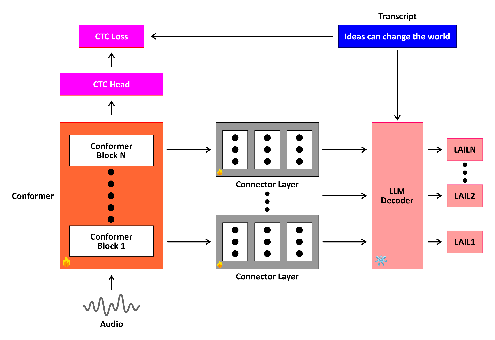

# Boosting CTC-Based ASR Using LLM-Based Intermediate Loss Regularization
This repository contains the codes for the TSD2025 paper paper [Boosting CTC-Based ASR Using LLM-Based Intermediate Loss Regularization](). 

## Overview

Our work presents a novel auxiliary loss framework called Language-Aware Intermediate Loss (LAIL) to enhance CTC-based ASR using the linguistic knowledge of large language models (LLMs). By attaching connector layers to intermediate encoder layers, LAIL maps outputs to the embedding space of an LLM and computes a causal language modeling loss during training. This approach enhances linguistic modeling while preserving the computational efficiency of CTC decoding. Using the Conformer architecture and various LLaMA models, we demonstrate significant improvements in Word Error Rate (WER) on the LibriSpeech, TEDLIUM2, and WSJ corpora, achieving state-of-the-art performance for CTC-based ASR with minimal computational overhead.

</img>

## Setup
For firing up the experiment run `run.sh` directly. 

